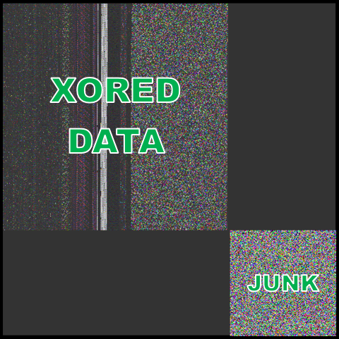
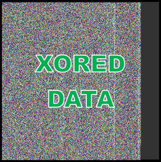

# AgentTesla Partial Unpacker
Copyright (c) 2023, tan2pow16. All rights reserved.

A set of similar tools I made and have been using for quite a while to extract AgentTesla intermediate payload DLL.

## Intro
In the last couple of years, AgentTesla samples are usually packed with a dedicated 2-layer C# packer. The first layer contains a PNG bitmap as a resource and a small stub DLL which will be loaded with reflection to decode the bitmap. The second layer is a DLL decoded from the bitmap and will again be loaded via reflection to unpack the final payload. This toolset is designed to extract the first layer from the encoded PNG bitmaps.  

From my experience, there are two strains of such packers circulating in the wild.

### Strain 1
This strain is currently far more common, containing a bitmap with the alpha channel enabled. In recent days the bitmaps have two parts: the larger, top-left square that packs the actual payload, and an opaque square of random trash pixels sitting at the bottom-right corner. The garbage data is usually 150 px wide. Usually, the XOR key used in this strain is just 3-byte long and can be easily cracked.  

*Sample:*  

### Strain 2
This strain uses opaque pixels along with GZIP to pack the data. The XOR keys used are much longer in this strain and usually cannot be cracked with just the supplied bitmaps.  

*Sample:*  

## Usage
First, extract the resource PNG using [dnSpy](https://github.com/dnSpyEx/dnSpy).  

**Strain 1:**  
&nbsp;&nbsp; `node unpack_strain1.js <path/to/bitmap.png> <discard-width> [hex-key]`  
&nbsp;&nbsp; If you see two squares in the bitmap, quite often the `discard-width` would be 150 (pixels). Moreover, XOR keys can usually be cracked with just the supplied bitmap so you probably don't have to explicitly supply them.

**Strain 2:**  
&nbsp;&nbsp; `node unpack_strain2.js <path/to/bitmap.png> <key>`  
&nbsp;&nbsp; For this strain, the keys are longer and you will have to figure it out by reversing the packed input. The outermost layer is rarely obfuscated and one can easily spot the ascii-based XOR keys within them.  

## Prerequisite
Node.js v12+ and the [pngjs](https://www.npmjs.com/package/pngjs) library are required.